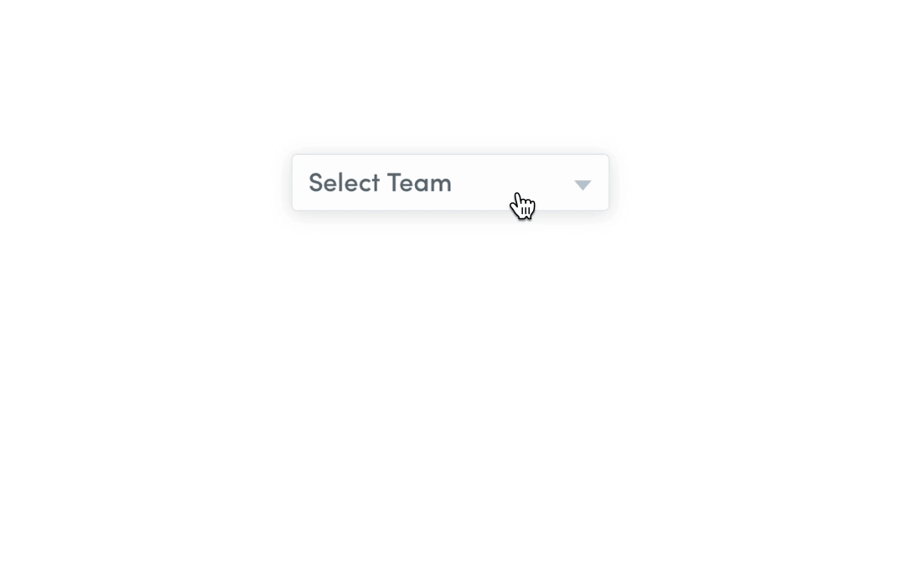

# Dropdown Module for Framer

A simple module for creating a dropdown menu.

## How To Install
<a href='https://open.framermodules.com/Dropdown'>
    </a>

or

- Copy the ```Dropdown.coffee``` file to your prototype's ```modules``` folder.
- Call ```{dropdown} = require "Dropdown"``` in your Framer prototype.

#### [Try the live demo](https://framer.cloud/ACJRi)



## How To Use

#### Initialize the tooltip
```coffeescript
# Use dropdown -> ( layerTrigger, layerDropdown, layerTriggerBgColour[optional], "true" -> update text selected for layerTrigger )
dropdown.Dropdown(Selector, Dropdown, "#fcfcfc", true)
```
